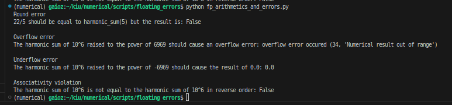
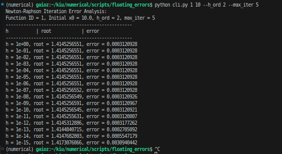
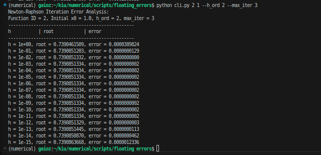

# Floating Point Errors

## Overview
This project explores various types of floating-point errors across two main parts:

- **Part 1:** Demonstrates inaccurate floating-point calculations using the example of **Harmonic Sums**. We examine rounding errors, underflow, overflow, and violations of the associative property in floating-point arithmetic.
- **Part 2:** Shows the results of the **Newton-Raphson iteration**. This implementation uses Richardson extrapolation of either order 2 or order 4, and we observe the errors generated. A command-line interface (CLI) is available for easy access.

## Installation
To get started, install the following dependencies:

```bash
pip install matplotlib numpy
```
## Part 1: Harmonic Sums and Floating-Point Errors

Implementation is available in `fp_arithmetics_and_errors.py`. 

To run the script and view the results, execute:

```bash
python fp_arithmetics_and_errors.py
```



## Part 2: Newton-Raphson Iteration and Error Analysis

In this part, we implement the Newton-Raphson method to find the roots of functions with irrational roots. The functions chosen for this analysis are:

- **Function 1:** \( f(x) = x^2 - 2 \) (Root: \( \sqrt{2} \))
- **Function 2:** \( f(x) = \cos(x) - x \) (Root: approximately 0.739085)

### Implementation

The implementation is provided in `cli.py`. This script performs Newton-Raphson iterations and prints the errors for different step sizes \( h \).

### Usage

To run the script, use the following command:

```bash
python cli.py <fun:int> <x0:float> [--h_ord:<2|4>] [--max_iter:<int>]
```

### Arguments

- **`fun`**: Function ID
  - `1`: Represents \( f(x) = x^2 - 2 \)
  - `2`: Represents \( f(x) = \cos(x) - x \)

- **`x0`**: Initial guess for the root (float)

- **`--h_ord`**: (Optional) Order of Richardson extrapolation (default is 2). Possible values:
  - `2`: Second-order extrapolation
  - `4`: Fourth-order extrapolation

- **`--max_iter`**: (Optional) Maximum number of iterations for the Newton-Raphson method (default is 2).


### Example

As you can see, initially erorrs are decreaseing, but after some point, they start to increase. 




